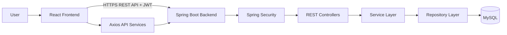
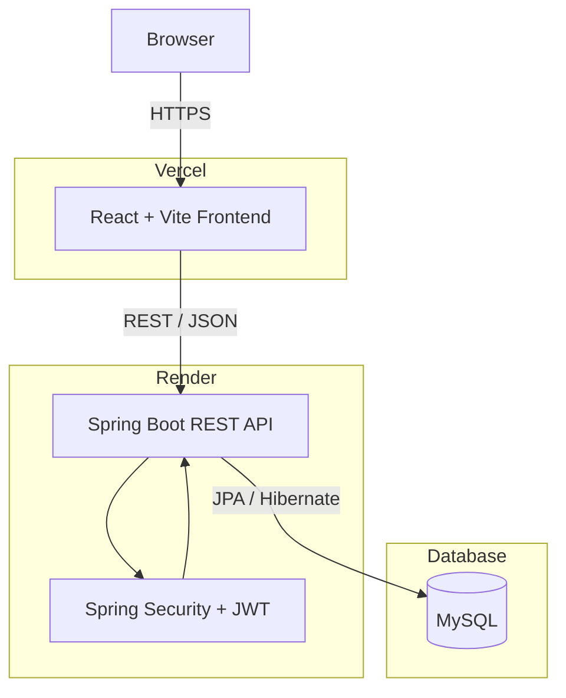
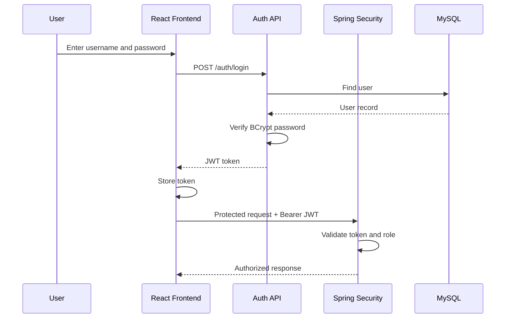
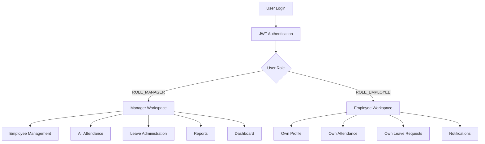
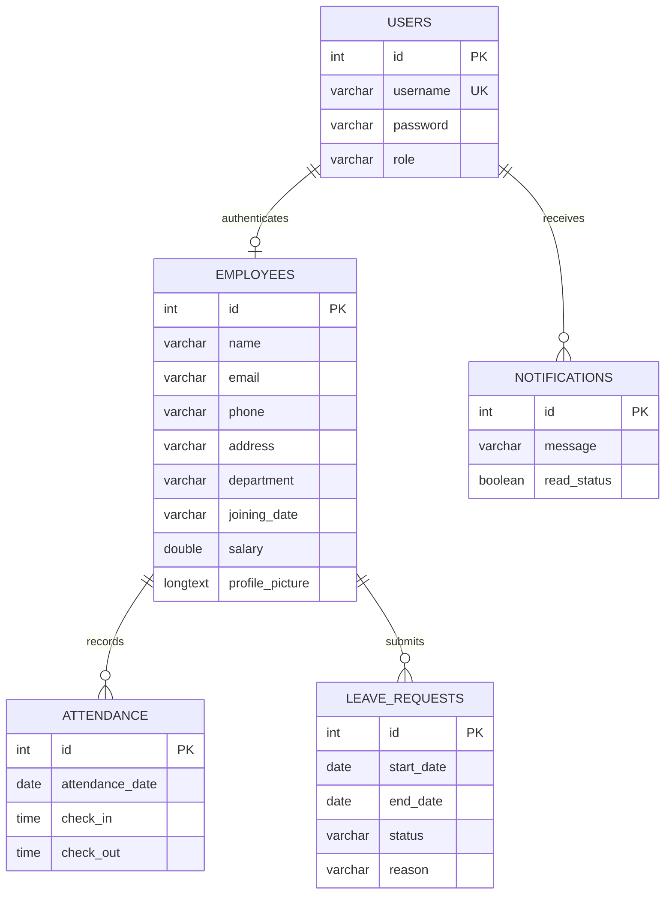
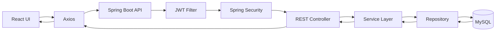

# TechNova Solutions --- Employee Management & HR Portal

> A full-stack Employee Management and Human Resources portal built with
> **React.js, Spring Boot, Spring Security, JWT, MySQL, REST APIs, Vite,
> Axios, Vercel, and Render**.

------------------------------------------------------------------------

## 📌 Overview

**TechNova Solutions HR Portal** is a full-stack web application
designed to manage employees and common HR operations through dedicated
Manager and Employee workspaces.

The project demonstrates an end-to-end production workflow:

-   React-based responsive frontend
-   Spring Boot REST backend
-   MySQL relational database
-   Spring Security authentication and authorization
-   JWT-based stateless authentication
-   Role-based access control
-   RESTful API integration with Axios
-   CORS configuration
-   Environment-based API configuration
-   Git/GitHub version control
-   Frontend deployment on Vercel
-   Backend deployment on Render

------------------------------------------------------------------------

## ✨ Key Features

### 🔐 Authentication & Authorization

-   Manager and Employee login
-   JWT-based authentication
-   Stateless Spring Security configuration
-   Role-based authorization using `ROLE_MANAGER` and `ROLE_EMPLOYEE`
-   Protected REST endpoints
-   Authenticated profile access
-   Password change functionality
-   Logout functionality

### 👥 Employee Management

Managers can:

-   Add employees
-   View all employees
-   Search employees by name
-   View employee details
-   Edit employee information
-   Delete employees
-   Manage employee profiles
-   Use pagination and sorting

### 🕒 Attendance Management

-   Employee check-in
-   Employee check-out
-   Today's attendance
-   Personal attendance history
-   Manager access to attendance records
-   Attendance search

### 📝 Leave Management

-   Apply for leave
-   View personal leave requests
-   Manager access to pending requests
-   Manager access to all requests
-   Leave approval/rejection workflow

### 🔔 Notifications

-   User-specific notifications
-   Protected notification APIs
-   Notification integration with the main application layout

### 📊 Dashboard & Reports

-   Manager dashboard
-   Employee/attendance/leave statistics
-   HR reporting endpoints
-   Dedicated reports module

### 👤 Profile & Settings

-   View logged-in employee profile
-   Update profile information
-   Password change
-   Role-aware access control

------------------------------------------------------------------------

# 🏗️ System Architecture



### Production Architecture



------------------------------------------------------------------------

# 🔄 Authentication Flow



------------------------------------------------------------------------

# 🔒 Role-Based Access Control



Authorization is enforced by Spring Security on the backend, for
example:

``` java
.hasRole("MANAGER")
```

and:

``` java
.hasAnyRole("MANAGER", "EMPLOYEE")
```

This means frontend visibility is not the only security mechanism;
protected operations are also checked by the backend.

------------------------------------------------------------------------

# 🗄️ Database Architecture

The project uses MySQL for persistent application data.



> The diagram represents the logical application relationships; the
> exact database schema may evolve with implementation changes.

------------------------------------------------------------------------

# 🔌 REST API Structure

## Authentication

``` text
POST   /auth/login
POST   /auth/register
PUT    /auth/change-password
```

## Employees

``` text
GET    /employees
POST   /employees
GET    /employees/search?name={name}
GET    /employees/{id}
GET    /employees/me
PUT    /employees/me/profile
GET    /employees/page?page={page}&size={size}
GET    /employees/sort
PUT    /employees/{id}
DELETE /employees/{id}
```

## Attendance

``` text
POST   /attendance/checkin
POST   /attendance/checkout
GET    /attendance/today
GET    /attendance/my-history
GET    /attendance/all
GET    /attendance/search
```

## Leave Management

``` text
POST   /leaves
GET    /leaves/my-requests
GET    /leaves/pending
GET    /leaves/all
```

## Notifications

``` text
GET    /notifications/**
```

## Reports

``` text
GET    /reports/**
```

## Dashboard

``` text
GET    /dashboard/**
```

> Endpoint access is controlled by the authenticated user's role.

------------------------------------------------------------------------

# 🧩 Project Structure

``` text
SpringBoot_project/
│
├── Backend/
│   ├── src/
│   │   ├── main/
│   │   │   ├── java/com/employee/
│   │   │   │   ├── controller/
│   │   │   │   ├── dto/
│   │   │   │   ├── entity/
│   │   │   │   ├── exception/
│   │   │   │   ├── repository/
│   │   │   │   ├── security/
│   │   │   │   └── service/
│   │   │   │
│   │   │   └── resources/
│   │   │       └── application.properties
│   │   │
│   │   ├── test/
│   │   ├── pom.xml
│   │   └── Dockerfile
│   │
│   └── HELP.md
│
├── frontend/
│   ├── src/
│   │   ├── components/
│   │   ├── pages/
│   │   ├── services/
│   │   ├── styles/
│   │   ├── App.jsx
│   │   └── main.jsx
│   │
│   ├── public/
│   ├── package.json
│   ├── .env
│   └── vercel.json
│
└── README.md
```

------------------------------------------------------------------------

# 🛠️ Technology Stack

  Area              Technology         Purpose
  ----------------- ------------------ ------------------------------
  Frontend          React.js           UI development
  Frontend          JavaScript / JSX   Application logic
  Frontend          Axios              REST API communication
  Frontend          React Router       Client-side navigation
  Frontend          Vite               Build tooling
  Frontend          CSS                Styling
  Backend           Java               Backend programming
  Backend           Spring Boot        REST API framework
  Backend           Spring MVC         REST controllers
  Backend           Spring Data JPA    Database access
  Backend           Hibernate          ORM
  Security          Spring Security    Authentication/authorization
  Security          JWT                Stateless authentication
  Security          BCrypt             Password hashing
  Database          MySQL              Relational data storage
  Build             Maven              Dependency/build management
  Deployment        Vercel             Frontend hosting
  Deployment        Render             Backend hosting
  Version Control   Git/GitHub         Source control

------------------------------------------------------------------------

# 🔐 Security Implementation

### Password Security

The application uses BCrypt password encoding:

``` java
new BCryptPasswordEncoder()
```

Passwords should not be stored as plain text.

### JWT Authentication

Protected requests use:

``` http
Authorization: Bearer <JWT_TOKEN>
```

The JWT authentication filter validates the token before protected
requests reach the application.

### Stateless Sessions

The backend uses:

``` java
SessionCreationPolicy.STATELESS
```

so authentication is handled through JWT rather than server-side HTTP
sessions.

### CORS

The backend includes centralized CORS configuration so the separately
deployed React frontend can communicate with the Spring Boot API.

------------------------------------------------------------------------

# 🌐 Environment Configuration

The Vite frontend uses an environment variable for the backend URL:

``` env
VITE_API_URL=https://your-backend-url.onrender.com
```

The frontend service layer uses:

``` javascript
const API_URL = import.meta.env.VITE_API_URL;
const EMPLOYEES_URL = `${API_URL}/employees`;
```

### Security Note

Do not commit:

-   Database passwords
-   JWT secrets
-   API keys
-   Private credentials

Use environment variables for deployment secrets and sensitive
configuration.

------------------------------------------------------------------------

# 🚀 Local Development

## 1. Clone the repository

``` bash
git clone https://github.com/your-username/your-repository.git
cd your-repository
```

## 2. Backend Setup

``` bash
cd Backend
```

Configure MySQL in:

``` text
src/main/resources/application.properties
```

Example:

``` properties
spring.datasource.url=jdbc:mysql://localhost:3306/railway
spring.datasource.username=YOUR_USERNAME
spring.datasource.password=YOUR_PASSWORD

spring.jpa.hibernate.ddl-auto=update
spring.jpa.show-sql=true
```

Run the backend:

### Windows

``` powershell
.\mvnw.cmd spring-boot:run
```

### Linux/macOS

``` bash
./mvnw spring-boot:run
```

Backend:

``` text
http://localhost:8080
```

## 3. Frontend Setup

``` bash
cd frontend
npm install
```

Create `.env`:

``` env
VITE_API_URL=http://localhost:8080
```

Start:

``` bash
npm run dev
```

Frontend:

``` text
http://localhost:5173
```

------------------------------------------------------------------------

# 📦 Production Deployment

## Frontend --- Vercel

Typical configuration:

``` text
Root Directory: frontend
Build Command: npm run build
Output Directory: dist
```

Production variable:

``` text
VITE_API_URL=https://your-backend-url.onrender.com
```

Because Vite embeds `VITE_*` values during the build, redeploy the
frontend after changing production environment variables.

## Backend --- Render

Deploy the Spring Boot backend as a Render service and configure its
production database/environment variables.

Production request flow:

``` text
Vercel React App
       │
       │ HTTPS
       ▼
Render Spring Boot API
       │
       │ JPA / Hibernate
       ▼
MySQL
```

------------------------------------------------------------------------

# 🧪 Testing Checklist

### Authentication

-   [x] Manager login
-   [x] Employee login
-   [x] Invalid credentials rejected
-   [x] Protected endpoints require authentication
-   [x] Role restrictions enforced

### Employees

-   [x] Load employee list
-   [x] Search employees
-   [x] Add employee
-   [x] Edit employee
-   [x] Delete employee
-   [x] Employee profile

### Attendance

-   [x] Check in
-   [x] Check out
-   [x] Today's attendance
-   [x] Attendance history

### Leaves

-   [x] Apply for leave
-   [x] View own requests
-   [x] Manager review workflow

### Other Modules

-   [x] Dashboard
-   [x] Notifications
-   [x] Reports
-   [x] Profile
-   [x] Settings
-   [x] Logout

------------------------------------------------------------------------

# 🔧 Development & Debugging

The application was tested across local and production environments.

Important integration areas included:

-   Vite environment variables
-   Frontend API URL configuration
-   CORS configuration
-   React production routing
-   REST endpoint paths
-   JWT authorization headers
-   Spring Security role matching
-   Vercel deployment
-   Render deployment
-   Render application logs
-   Browser DevTools network debugging
-   Git/GitHub deployment workflow

### Request Flow



------------------------------------------------------------------------

# 📈 Future Improvements

Potential enhancements include:

-   Refresh-token authentication
-   More granular permissions
-   Email notifications
-   Employee document uploads
-   Advanced attendance analytics
-   PDF/Excel report export
-   Audit logging
-   Automated unit/integration tests
-   GitHub Actions CI/CD
-   Docker Compose development environment
-   Database indexing optimization
-   Advanced dashboard charts
-   Email-based password reset
-   Multi-department administration
-   Additional mobile-responsive improvements

------------------------------------------------------------------------

# 📸 Screenshots

Recommended GitHub screenshot structure:

``` text
docs/
└── screenshots/
    ├── login.png
    ├── manager-dashboard.png
    ├── employee-directory.png
    ├── attendance.png
    ├── leaves.png
    └── reports.png
```

Then add them to this README:

``` markdown


```

------------------------------------------------------------------------

# 🧠 Skills Demonstrated

This project demonstrates practical experience with:

-   Full-stack application development
-   React component architecture
-   REST API design
-   Axios API integration
-   JWT authentication
-   Spring Security
-   Role-based authorization
-   BCrypt password hashing
-   Spring Data JPA
-   Hibernate
-   MySQL
-   CRUD operations
-   Search and filtering
-   Pagination and sorting
-   CORS
-   Environment variables
-   Production deployment
-   Git and GitHub
-   Production debugging

------------------------------------------------------------------------

# 👨‍💻 Author

**Bhanu**

Full-Stack Java Developer\
**Java \| Spring Boot \| React \| MySQL \| REST APIs**

### Project

**TechNova Solutions --- Employee Management & HR Portal**

------------------------------------------------------------------------

# 📄 License

This project is intended for educational, portfolio, and demonstration
purposes.

Add an appropriate open-source or proprietary license if the project
will be distributed.

------------------------------------------------------------------------

## ⭐ Support

If you found this project useful, consider giving the repository a ⭐ on
GitHub.
